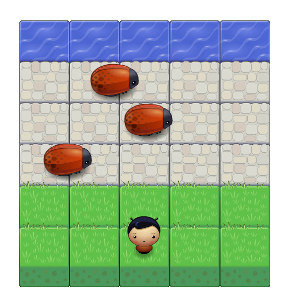

# [Udacity Classic Arcade Game Clone](https://github.com/udacity/frontend-nanodegree-arcade-game)

In this game you have a Player (controlled by you) and Enemies (auto controlled). your goal is to reach the water, without touching any one of the enemies. you can move left, right, up and down. The enemies move in varying speeds on the paved block portion of the scene. Once you touch  an enemy, the game is reset and the player moves back to the start square. And if you reaches the water without touching any enemy then you won the game.

## Demo

## How to Play
Load this link in your browser (http://ujjawalponia.github.io/classic-arcade-game/).

## Follow Me On Social Media
* https://www.facebook.com/ujjawalponia
* https://twitter.com/pooniaujjawal
* https://in.linkedin.com/in/ujjawal-poonia-857b86121
* https://www.instagram.com/pooniaujjawal/
